# Actividad  de Docker y Ubuntu 

Aprendiz : Maria Jose Rodriguez Oyola

Ficha : 3145555

## 1) Primero se crean las imagenes y contenedores en Docker (Mysql): 

Se intalan las imagenes y contenedores en el cmd con los siguientes  comandos

 - > Imagen para Mysql:  docker pull mysql:latest 

- > contenedor:   docker pull mysql:latest :  docker run -d --name mymysql  -e MYSQL_ROOT_PASSWORD=12345 -e MYSQL_DATABASE=prueba -p 3309:3306 mysql:8.0

#### ejemplo (mi contenedor) : 

 > docker run -d --name my-sql_database -e MYSQL_ROOT_PASSWORD=12345 -e MYSQL_DATABASE=mydb -p 3309:3306 mysql:lastest 

  Se verifica que este conectado a la base de Datos en Mysql: 

  ### 1.1 )  Se crea una los esquemas. 

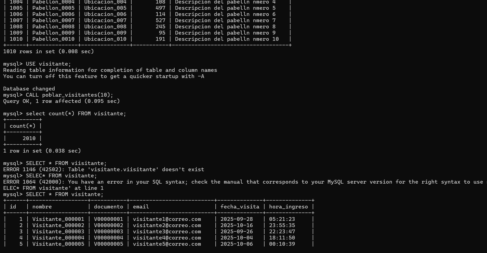

### 1.2 )  Se crean las imagenes y contenedores  en Docker (PostgreSQL): 

( mi imagen y contenedor)

> Imagen: docker pull postgres

> Contenedor:  docker run --name postgres-container -e POSTGRES_USER=maria123 -e POSTGRES_PASSWORD=12345 -p 5436:5432 -d postgres

Se verifica que este conectado a la base de Datos en PostgreSQL: 

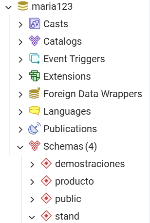

### 1.3  )  Se crea los esquemas, usuarios, contraseñas  del usuario y las 1000 inserciones. 

> Esquemas 
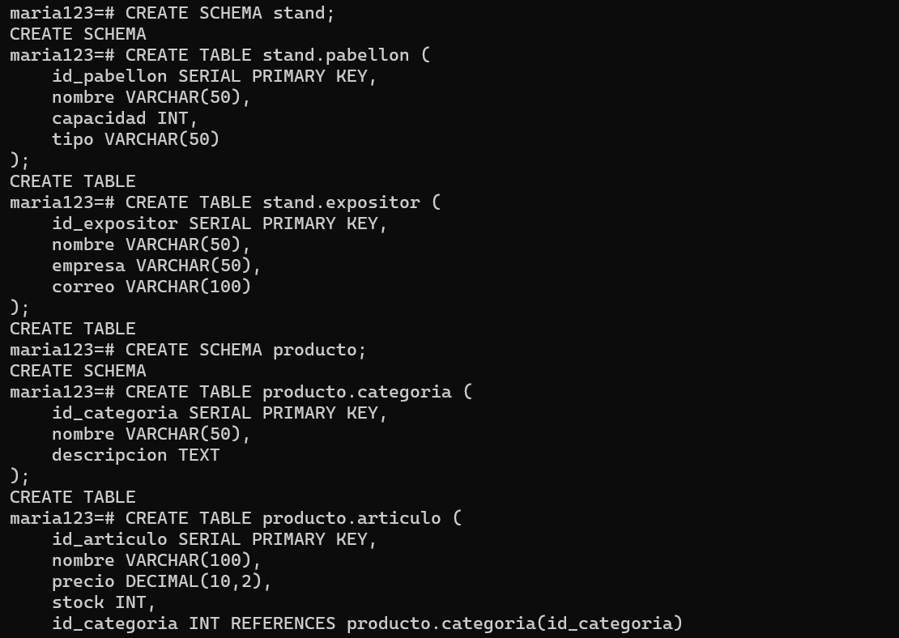

> Usuarios con sus contraseñas
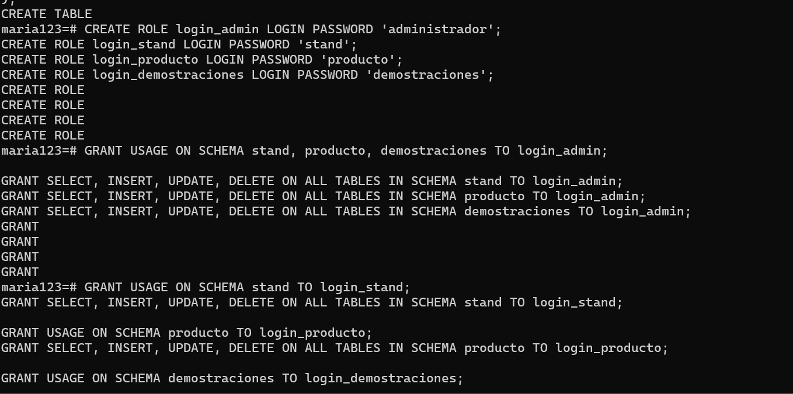

> 1000 inserciones
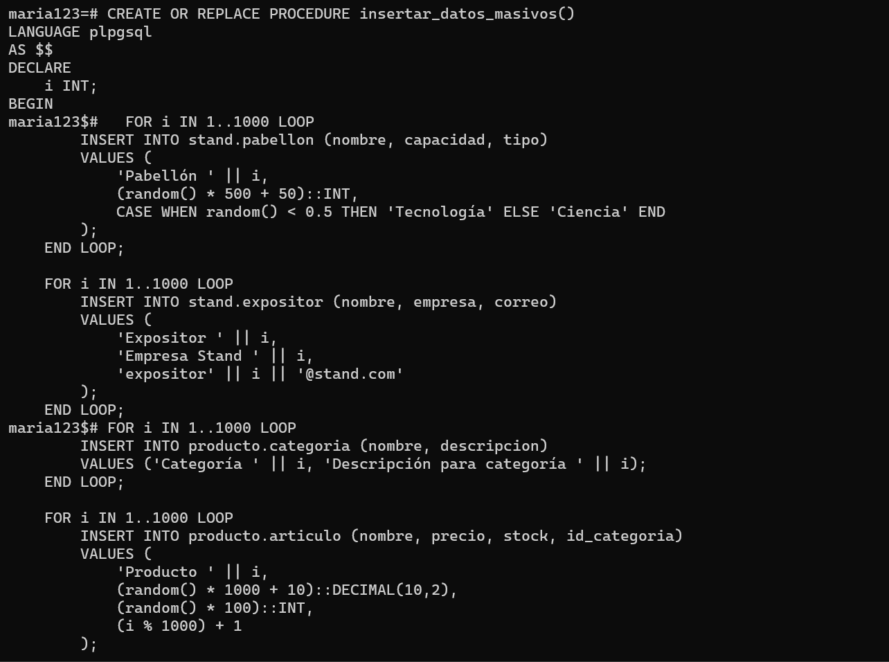

### 1.4 )  Se crean las imagenes y contenedores  en Docker (SQL Server):

( mi imagen y contenedor)

> imagen: docker pull mrc.microsoft.com/mssql/server:2022-latest 

> contenedor : docker run -e "ACCEPT_EULA=Y" -e "MSSQL_SA_PASSWORD=Admin123!" -p 1435:1433 --name sqlserver2022 -d mcr.microsoft.com/mssql/server:2022-latest

Se verifica que este conectado a la base de Datos en SQL server:

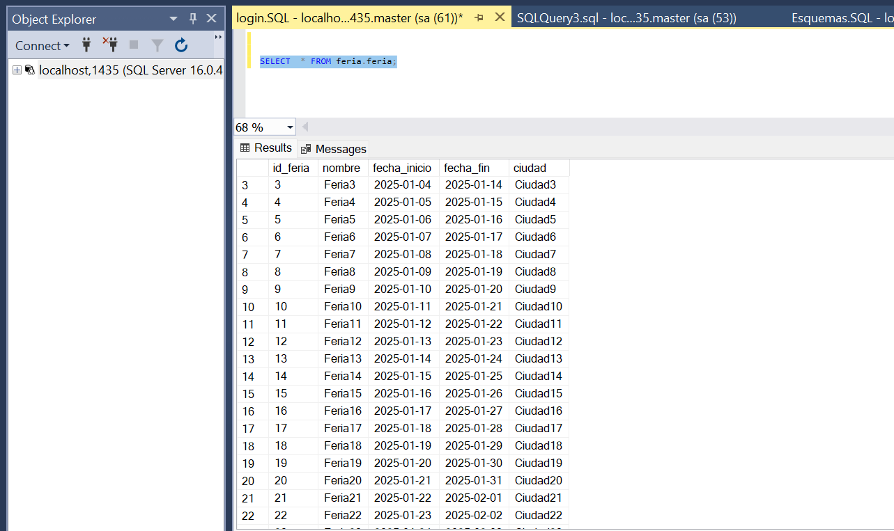
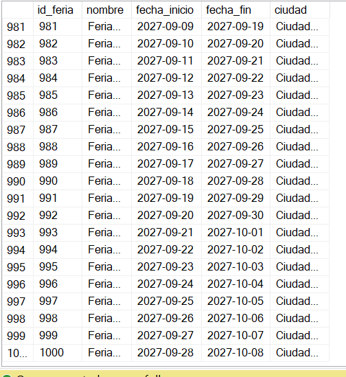
### 1.5 ) muestra la insercion
> inserciones en CMD
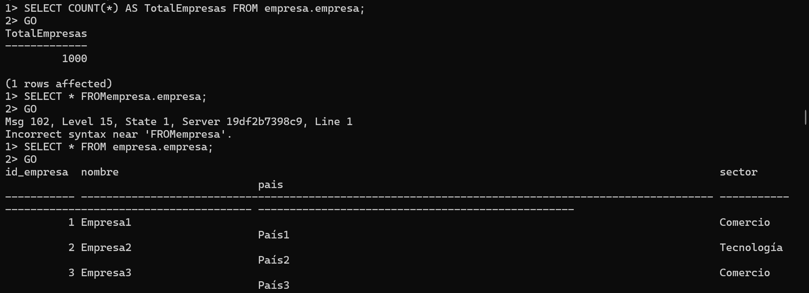

### 1.6 ) Se crean las imagenes y contenedores en Docker (Mongo DB ) un No sql:
( mi imagen y contenedor)

> imagen: docker pull mongo

>contenedor: docker run -d --name mymongo -p 27017:27017 -e MONGO_INITDB_ROOT_USERNAME=mongo -e MONGO_INITDB_ROOT_PASSWORD=12345 mongo

- para ingresar al contenedor de mongo 
 > docker exec -it mymongo mongosh -u mongo -p 12345

### 1.7  ) Se crea los esquemas, usuarios, contraseñas del usuario y las 1000 inserciones.

> esquemas 

> las 1000 inserciones

> mostrar inserciones 

## 2 ) Crear mi Ubuntu dentro de Docker

Ahoralo lo que  vamos a hacer es crear un ubuntu, que es como el cliente para asi crear las 4 bases de datos, el comando para crear esa red compartida es el siguente.

> docker network create red-bases

y conectos mis contenedores, segun ell ombre que tengo asignado para cada uno: 

(mis contenedores)

> docker network connect red-bases my-sql_database

> docker network connect red-bases postgres-container

> docker network connect red-bases sqlserver2022

> docker network connect red-bases mi_mongo

Luego verifico que esten conectadas:

> docker network inspect red-bases

Y le sale algo como : 

> "Name": "red-bases", "Id": "3d287eeb40faf83ab478fd9f1d126aecbea4c65fd0a2c365355f59150c5809ac", "Created": "2025-10-26T19:29:47.027117049Z", "Scope": "local", "Driver": "bridge", "EnableIPv4": true, "EnableIPv6": false, "IPAM": { "Driver": "default", "Options": {}, "Config": [ { "Subnet": "172.18.0.0/16", "Gateway": "172.18.0.1" } ] }, "Internal": false, "Attachable": false, "Ingress": false, "ConfigFrom": { "Network": "" }, "ConfigOnly": false, "Containers": { "19df2b7398c907424f13656208ba57cb69f1c419fa88ba86950ab1b08332bc36": { "Name": "sqlserver2022", "EndpointID": "33d67931047e42f9b085a36ea3855b81921d4c4e057154559620c61faa038177", "MacAddress": "62:13:8e:7b:82:ae", "IPv4Address": "172.18.0.4/16", "IPv6Address": "" }, "8fedb44b589df307d95216d011e3e9dfe6bb88d454ac5f7a2411bbc9feb9f0d3": { "Name": "mi_mongo", "EndpointID": "dc62f6914ec404a8ff70c28459603228fc79f3dad1a70cb3184fbc4990b10ea6", "MacAddress": "62:17:82:95:ba:aa", "IPv4Address": "172.18.0.5/16", "IPv6Address": "" }, "c2db01511271fcf0dc35ac9a6efc2e28df0ad6a9a69fc1f0db9733d5891a2530": { "Name": "postgres-container", "EndpointID": "8eb053ca432343cc64a0031d2b34846bad2642d9e184f4a9c8436fe9f85773a9", "MacAddress": "32:ba:f0:1e:20:96", "IPv4Address": "172.18.0.3/16", "IPv6Address": "" }, "ff67fc44eca8397b1e0d0cc3075cc22f21049028faf476d10da0ea8c7b051678": { "Name": "my-sql_database", "EndpointID": "04fa7ac5ef57e94cf3fed979beb3012b37b8a56ea91f3cf8c14f0b9ae3e57cd4", "MacAddress": "96:64:77:d4:7c:c4", "IPv4Address": "172.18.0.2/16", "IPv6Address": "" } }, "Options": { "com.docker.network.enable_ipv4": "true", "com.docker.network.enable_ipv6": "false" }, "Labels": {} } ]

Aqui ya aparecen mis 4 bases de datos conectadas.

despues de eso paso a intalar los 4 clientes de las bases de datos, 

> apt update -y

> apt install mysql-client postgresql-client mongodb-clients curl -y

### 2.1) Podrás  las conexiones desde Ubuntu:

- Mysql 

Primero actualiza los repositorios

>apt update -y

Instala el cliente de MySQL

> apt install -y mysql-client

Luego pruevo la coneccion de Mysql, ( para esto pide la contraseña que normalmente cree en el contenedor de Docker)

> mysql -h 172.18.0.2 -P 3306 -u root -p

se muestra todas las bases de datos que cree en ese contenedor de Mysql: 

### 2.2) Podrás  las conexiones desde Ubuntu con (PostgreSQL):

-  PostgreSQL

Instala el cliente de PostgreSQL

>apt install -y postgresql-client

Luego pruevo la coneccion de PostgreSQL. 

> psql -h 172.18.0.3 -U postgres

se muestra todas las bases de datos que cree en ese contenedor de PostgreSQL:

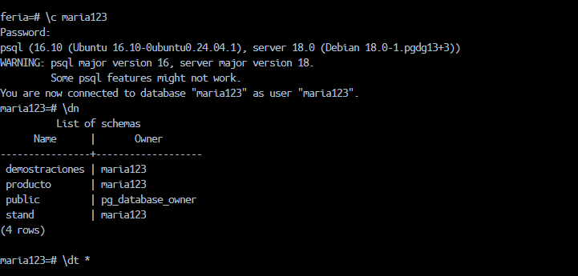

Inserciones creadas
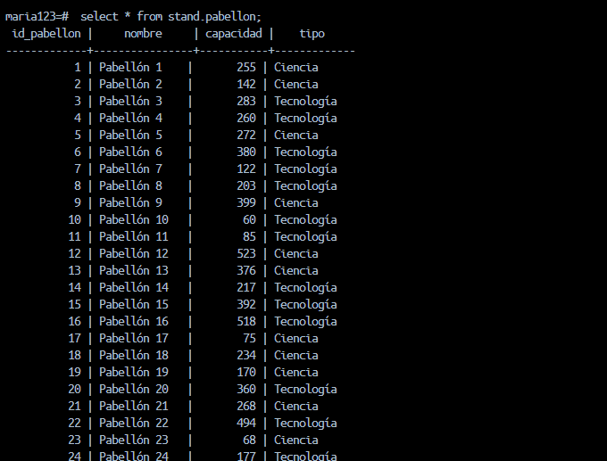
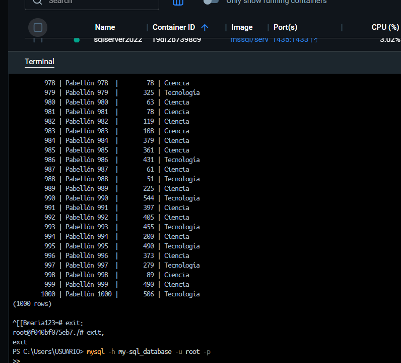

### 2.3 ) Podrás  las conexiones desde Ubuntu con (SQL server):

- SQL server

Instala el cliente y herramienta de SQL server 

se verifica que este intalado

Conéctate al SQL Server (desde el mismo Ubuntu cliente)

(Visualisamos mis base de datos)
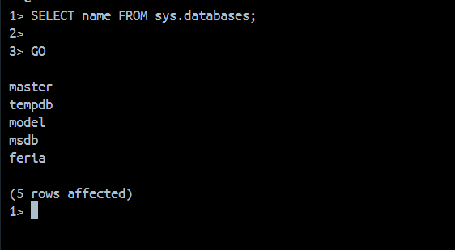

### 2.1) Podrás las conexiones desde Ubuntu:
 - Mongo 
Primero actualiza los repositorios
> apt update -y

 intalo el cliente de mongo 
> apt install -y mongodb-clients

>Verifica los nombres de tus contenedores

 Crear una red común para ambos contenedores
> docker network create mynet

Conectar los contenedores a esa red

Conecta MongoDB y Ubuntu a la misma red:

> docker network connect mynet mymongo

>docker network connect mynet mi-ubuntu

Confirmar que están conectados
> docker network inspect mynet

se ven los contenedores conectados 

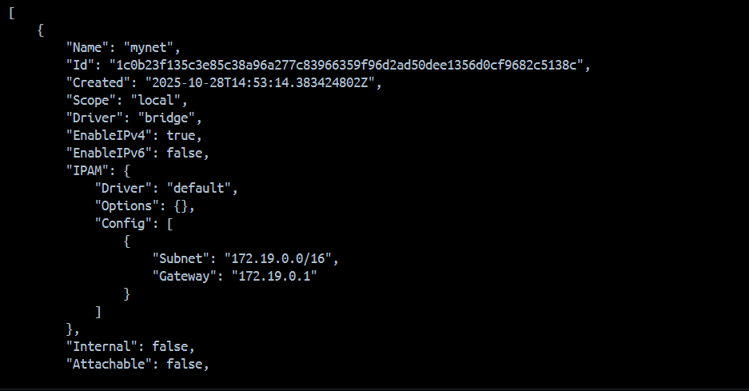

para ver las inserciones y lo que se realiza en el ubunto se  debe ingresar al contenedor 

> docker exec -it mi-ubuntu bash

Conéctate al MongoDB dentro del contenedor

Se veriica si las bases de mongo estan creadas 

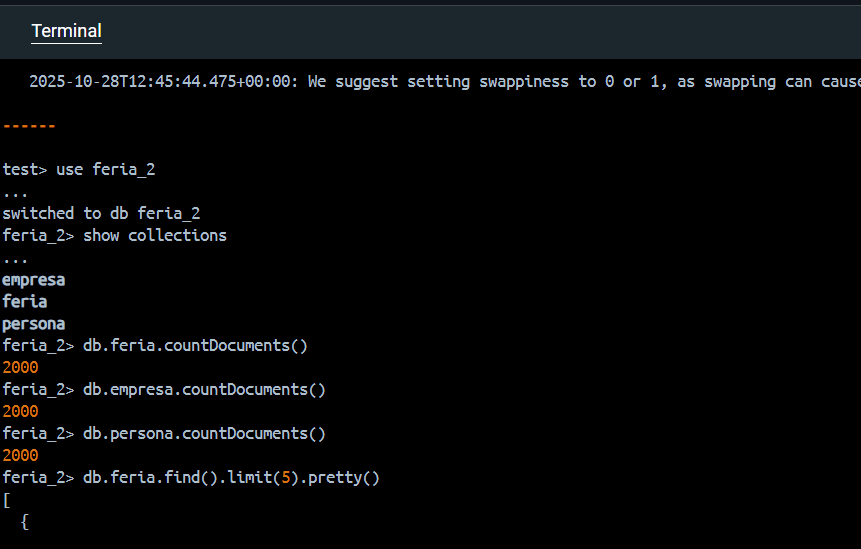

## 3) Ubuntu tenga su propio Docker interno,

Instalar Docker dentro de tu contenedor Ubuntu

